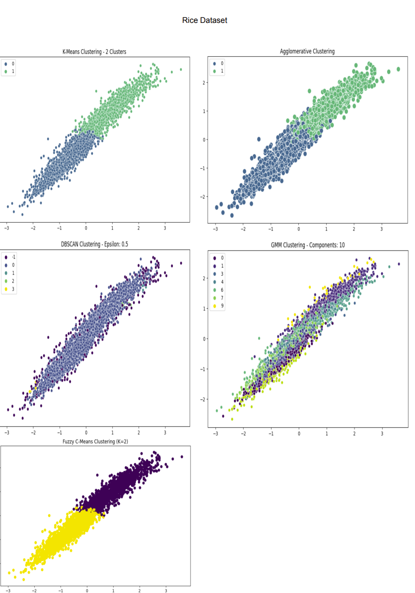

# Clustering Algorithms Comparison

This repository contains the implementation and comparison of clustering algorithms (K-Means, Fuzzy C-Means, Gaussian Mixture Model, Agglomerative, and DBSCAN) on six different datasets. The goal is to evaluate the performance of these algorithms and understand their strengths and weaknesses in different scenarios.

## Datasets

1. **Dataset 1**: Rice Dataset
2. **Dataset 2**: Electrical Grid Large Dataset
3. **Dataset 3**: Online Shoppers Intention Dataset
4. **Dataset 4**: Gas Turbine Dataset
5. **Dataset 5**: Seoul Bike Dataset
6. **Dataset 6**: Facebook Dataset

## Clustering Algorithms

The following clustering algorithms were implemented and compared:

1. **K-Means**
2. **Fuzzy C-Means (FCM)**
3. **Gaussian Mixture Model (GMM)**
4. **Agglomerative**
5. **DBSCAN**

## Usage

### Prerequisites


### Installation

```bash
# Clone the repository
git clone https://github.com/MunnazzahAslam/Clustering-Project.git

# Change directory
cd Clustering-Project
```

## Results


## Discussion

## Conclusion


```